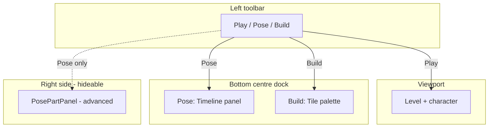

# Roadmap

Masquerade is becoming a **general-purpose 2D game creation tool**: design characters with a built-in pose and animation studio, build levels with an in-game tileset editor, and iterate without leaving the running game.

This document tracks product direction and engineering priorities. For how systems connect today, see [docs/ARCHITECTURE.md](docs/ARCHITECTURE.md). For author-facing workflows, see [docs/STUDIO.md](docs/STUDIO.md). For code that is being replaced, see [docs/LEGACY.md](docs/LEGACY.md).

## Vision

- **Characters first** — Create and animate diverse character rigs (sprite-based, pose markers, ragdoll-assisted) through in-game tooling.
- **Levels in the game** — Paint terrain, place entities, and tune gameplay layers from a build panel instead of only from the Godot editor.
- **Central workspace** — Frequent tools live in a large bottom-centre panel; advanced configuration lives in hideable side panels.
- **Accessible workspace** — Prefer curated palettes and in-game placement over sprawling scene trees for common authoring tasks.
- **General-purpose foundation** — Movement, combat, and entity logic should eventually be reusable across player characters, NPCs, and enemies.

## Studio layout model (target)

The player `PoseHUD` is organized around three UI zones:

| Zone | Node(s) | Role |
|------|---------|------|
| **Left toolbar** | `PoseToolBar` / mode bar | Play / Pose / Build mode switcher |
| **Bottom centre** | `PoseTimelineDock` (studio bottom dock) | **Pose:** timeline (primary animator workspace). **Build:** large tile/scene palette. **Play:** hidden or minimal |
| **Right side** | `PoseDockRow` / `PosePartPanel` | Advanced marker configuration (constraints, sprites, accessories). Hideable |

`AnimSection` (`PoseAnimBrowser` + `PoseAssistantPanel`) remains in the scene tree but is **intentionally hidden**. Useful features were moved to `PoseTimelinePanel`; the assistant panel is kept dormant unless revived later.

**Current state vs target:** Today there is only a “Posing” checkbox (defaults on), `BuildPanel` sits in the right dock, and the bottom dock always hosts the timeline. Tri-mode and bottom-dock swapping are the next engineering steps.

## Phase overview

| Phase | Focus | Status |
|-------|-------|--------|
| 0 | Project hygiene, folder layout, naming conventions | **Done** |
| 1 | Character animation studio (pose, timeline, ragdoll) | **Mostly complete** — timeline is the product surface |
| 2 | Studio mode UX (Play / Pose / Build) | **Done** |
| 3 | Build panel in bottom-centre dock | **Done** |
| 4 | Build depth (save, scene palette) | **Mostly complete** |
| 5 | Deprecate spawn pipeline | **Done** |
| 6 | Enemy and hazard art scale-up (16px legacy → 64px world) | Planned |
| 7 | General-purpose character controller | Future |
| 8 | Polished studio UX, project/session model, publishing | Future |

---

## Detailed roadmap

### Phase 0 — Project hygiene ✅ Done

- Lowercase top-level folders (`assets/`, `levels/`, `scenes/`)
- PascalCase filenames for `class_name` scripts; snake_case for non-class assets
- Bulk `res://` path repair after renames
- Developer docs: `README.md`, `AGENTS.md`, `docs/*`

**Remaining housekeeping:** merge open refactor PRs; manually verify `spawn_scene` scene bindings in Godot editor after path changes.

---

### Phase 1 — Character animation studio ✅ Mostly complete

**Status:** Core authoring is implemented. Animators work primarily on the **bottom-centre timeline**, not the hidden assistant panel.

#### Complete

| Capability | Location |
|------------|----------|
| Pose markers with constraints, look-at, follow-rot, accessories | `player/pose/PoseMarker.gd`, `PoseMarker.tscn` |
| Marker selection and manipulation | `player/pose/PoseController.gd` |
| Advanced part inspector (sprites, offsets, constraints) | `player/pose/PosePartPanel.gd` — **side panel** |
| Step-based timeline, keying, mirror, clipboard | `player/components/TimelineManager.gd` |
| Playback, record, step grid, ragdoll toggles, export | `player/pose/PoseTimelinePanel.gd` — **bottom dock** |
| Animation library selector | Timeline anim dropdown + `PoseAnimBrowser` (browser UI dormant in hidden `AnimSection`; list logic still used) |
| Ragdoll assist | `player/ragdoll/RagdollManager.gd`, body slots |
| Path-body drive authoring | `player/path/PathAnchorDriver.gd`, `PathGuideMarker.gd` |
| Animation persist / export to disk | `TimelineManager._persist_animation`, `save_animation_to_disk` |

#### Intentionally dormant

| Item | Notes |
|------|-------|
| `AnimSection` / `PoseAssistantPanel` | Hidden in `player.tscn`. Features duplicated on timeline via `register_timeline_mirrors()`. Kept for possible future use — **not a backlog gap**. |

#### Remaining (low priority until mode UX lands)

- Viewport marker picking polish when not posing
- Keyboard shortcut map (may interact with build-mode movement — see phase 2 note)
- Tutorial copy aligned with tri-mode workflow

**Acceptance (phase 1):** Authors can create, edit, and play back character animations in-game using the timeline and part panel. ✅ Largely met today.

---

### Phase 2 — Studio tri-mode (Play / Pose / Build) ✅ Done

**Goal:** One authoritative studio mode that gates movement, painting, and dock visibility.

| Task | Status |
|------|--------|
| `PoseModeBar.Mode` enum (`PLAY`, `POSE`, `BUILD`) | Done |
| Three-way toolbar buttons | Done |
| Default to **Play** | Done |
| Mode gating in `PoseHUD._apply_studio_mode` | Done |
| Build + movement coexistence | Done (initial design) |

**Key paths:** `player/pose/PoseModeBar.gd`, `player/pose/PoseHUD.gd`, `player/Player.gd`, `player/build/BuildPanel.gd`

---

### Phase 3 — Build panel → bottom-centre dock ✅ Done

**Goal:** Relocate tile authoring to the bottom-centre workspace.

| Task | Status |
|------|--------|
| `BuildPanel` in `PoseTimelineDock` | Done |
| Mode swap (timeline ↔ build) | Done |
| Enlarged dock in build mode | Done |
| Removed build UI from right dock | Done |

**Key paths:** `player/player.tscn`, `player/pose/PoseHUD.gd`, `player/build/BuildPanel.gd`

---

### Phase 4 — Side panel ergonomics

**Goal:** Match “central = frequent tools, sides = advanced config.”

| Task | Detail |
|------|--------|
| Collapse toggle on `PoseDockRow` / `PosePartPanel` | Pin or hide advanced inspector |
| Play mode | Hide entire right dock |
| Build mode | Part panel hidden by default; optional peek |

**Acceptance:** Play mode is a clean gameplay view; pose/build modes expose side panels only when needed.

---

### Phase 5 — Build depth (save, layers, scene palette) — **Mostly complete**

**Goal:** Make level authoring dependable beyond the prototype paint loop.

| Task | Priority | Status |
|------|----------|--------|
| **Level save** | High | **Done** — Save button in build dock; `LevelSave.gd` |
| **Scene placement palette** | High | **Done** — Entities tab; grid-snapped instances in `Enemies` |
| **Erase / select placed instances** | Medium | **Done** — RMB erase, click to select, Delete key |
| **Layer picker** | High | **Done** — dynamic tabs per `TileMapLayer` in the level |
| **Hotkey audit** | Medium | **Done** — see [STUDIO.md](docs/STUDIO.md) bindings; Ctrl defers to camera in build |

**Acceptance:** Paint on `test.tscn`, save, reload — tiles and placed entities persist. ✅ Met for `test.tscn`.

**Key paths:** `player/build/BuildPanel.gd`, `player/build/EntityPalette.gd`, `player/build/LevelSave.gd`, `levels/test.tscn`

---

### Phase 6 — Deprecate tile → scene spawn pipeline — **Done**

**Goal:** Remove the legacy Hazards-tile spawn path.

| Task | Status |
|------|--------|
| Scene palette replaces tile painting for entities | **Done** |
| Remove `hazards.gd` converter | **Done** |
| Delete deprecated sample levels (`01`–`05`) | **Done** |
| `test.tscn` uses direct instances only | **Done** |

`tileset_enemies.tres` / `tileset_controls.tres` `spawn_scene` bindings remain as **palette catalog metadata** only (read by `EntityPalette.gd`). Do not paint spawn tiles onto layers.

**Key paths:** `player/build/EntityPalette.gd`, [LEGACY.md](docs/LEGACY.md)

---

### Phase 7 — Enemy and hazard scale harmonization

Align entity art, collision, and movement with the 64×64 environmental tile grid and larger player sprite (256×256+).

- **Key paths:** `scenes/enemies/`, `scenes/hazards/`, `assets/enemies/`, `scenes/enemies/BaseEnemy.gd`
- **Acceptance:** Representative enemies and hazards look and feel correct on 64px terrain without legacy 16px assumptions.

Independent of studio UX; defer until authoring workflow is stable.

---

### Phase 8 — General-purpose character controller

Refactor the player stack into a reusable controller usable for multiple local players and script-driven enemies.

- **Key paths:** `player/Player.gd`, `player/states/`, `scenes/enemies/BaseEnemy.gd`
- **Note:** `SteerableCharacterBody2D` exists for arrow-following entities only — not the player FSM.
- **Acceptance:** Second controllable actor prototype; one enemy variant driven by shared controller logic.

---

### Phase 9 — Studio polish and publishing (future)

- Project/session model (which level, which character rig)
- Publishing / export flow
- Onboarding and in-game help aligned with tri-mode layout

---

## Implementation order (engineering)

Ordered list of build proposals — each builds on the previous where noted:

| # | Proposal | Phase | Depends on | Size | Status |
|---|----------|-------|------------|------|--------|
| 1 | **Tri-mode** (Play / Pose / Build) + mode gating | 2 | — | Small | **Done** |
| 2 | **Build panel → bottom-centre dock** (swap with timeline) | 3 | 1 | Medium | **Done** |
| 3 | **Hideable side panels** (collapse `PoseDockRow`) | 4 | 1 | Small | Next |
| 4 | **Level save** from build mode | 5 | 2 | Medium | **Done** |
| 5 | **Layer picker** for non-canonical `TileMapLayer` names | 5 | 2 | Medium | **Done** |
| 6 | **Scene placement palette** in bottom dock | 5 | 2, 4 | Medium | **Done** |
| 7 | **Hotkey audit** (play + build coexistence) | 5 | 1, 2 | Small–medium | **Done** |
| 8 | **Spawn migration** (remove `hazards.gd`, delete old levels) | 6 | 6 | Medium | **Done** |
| 9 | **Enemy scale harmonization** | 7 | — | Large |
| 10 | **Shared character controller** | 8 | — | Large |

**Recommended first PR:** #1 + #2 — **merged in studio tri-mode PR**.

**Recommended next PR:** #3 + #5 (side panel collapse + layer picker).

---

## Deprecations

| Item | Status | Replacement |
|------|--------|-------------|
| `spawn_scene` tile painting on Hazards layer | **Removed** | Entities tab in `BuildPanel` |
| `hazards.gd` runtime converter | **Removed** | Direct scene instances in `Enemies` |
| Sample levels `01`–`05` | **Removed** | `levels/test.tscn` only |
| 16×16 enemy art as source of truth | Legacy | Rescaled art + updated `BaseEnemy` collision |
| Monolithic `Player`-only movement | Legacy | Shared character controller module |
| `AnimSection` / `PoseAssistantPanel` as primary UI | Dormant | `PoseTimelinePanel` (kept in tree, hidden) |
| `BuildPanel` in right dock | Transitional | **Done** — bottom-centre dock in build mode |

## Out of scope (for now)

- Online multiplayer
- 3D authoring
- External marketplace / asset store integration
- Full visual scripting layer
- Re-enabling `AnimSection` unless explicitly requested

## How to propose changes

When opening a PR or agent task, tag which roadmap phase it serves and whether it touches **legacy** systems listed in [docs/LEGACY.md](docs/LEGACY.md).
