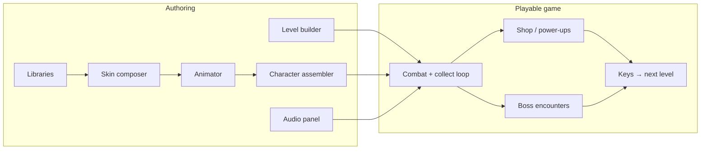

# Roadmap

Masquerade is a **2D game creation tool for building credible games and teaching game design**. Users open a project, browse libraries of characters and parts, skin and animate them, assemble characters from controllers, build levels, and play a complete gameplay loop — without leaving the app.

For how systems connect today, see [docs/ARCHITECTURE.md](docs/ARCHITECTURE.md). For author-facing workflows, see [docs/STUDIO.md](docs/STUDIO.md). For code being replaced, see [docs/LEGACY.md](docs/LEGACY.md).

---

## Vision

| Pillar | Goal |
|--------|------|
| **Teaching** | Low barrier: browse → customise → build → play in minutes |
| **Credible games** | Full loop: combat, collectables, shop, keys, bosses, level progression |
| **Character authoring** | Libraries of rigs, body parts, clothing; saved skins; attach to behaviour controllers |
| **Level authoring** | Art and collision on separate layers; entity palettes; in-game save |
| **Audio** | Music and SFX assignable from a studio panel |
| **Libraries over scene trees** | Curated palettes for characters, parts, hazards, collectables |

---

## Target product flow



---

## What exists today

Foundation already shipped; new milestones extend and connect these pieces.

| Area | Status | Key paths |
|------|--------|-----------|
| Studio tabs (Skin / Animate / Build / Play) | **Done** | `StudioTabBar`, `PoseHUD._apply_studio_tab` |
| Skin & animation studio | **Done** | `PoseMarker`, `PoseTimelinePanel`, `TimelineManager` |
| Level build (tiles, entities, save) | **Done** | `BuildPanel`, `LevelSave`, `EntityPalette` |
| Gameplay skeleton | **Partial** | `GameManager` (HP, keys, points), basic melee attack |
| Collectables | **Partial** | coin, key, heart, checkpoint under `scenes/collectibles/` |
| Enemies & hazards | **Partial** | `BaseEnemy`, hazard/platform scenes; 16px-scale art |
| Character library | **Not started** | — |
| Skin composer & saved skins | **Not started** | — |
| Controller assembly | **Not started** | — |
| Collision layer (art vs map) | **Not started** | — |
| Shop / money loop | **Not started** | — |
| Combat system v2 | **Not started** | — |
| Audio panel | **Not started** | — |
| Boss system | **Not started** | — |
| Project / home screen | **Not started** | — |
| M0 doc reset | **Done** | Roadmap, ARCHITECTURE, STUDIO, LEGACY, DEVELOPMENT |

---

## Milestones

### M0 — Project model & doc reset

**Goal:** One coherent product direction and a place to open work.

| Deliverable | Status | Detail |
|-------------|--------|--------|
| Roadmap & docs | **Done** | This document; `STUDIO.md`, `ARCHITECTURE.md`, `LEGACY.md`, `DEVELOPMENT.md` |
| **Project model** | Planned | A project holds levels, characters, skins, audio refs, game rules |
| **Home screen** | Planned | Open recent project or start from template |
| **Data layout** | Planned | e.g. `projects/<name>/characters/`, `levels/`, `audio/` |

**Acceptance (docs):** Docs reflect new direction; engineering tasks reference milestones (M0–M10).

**Acceptance (full M0):** Above plus project open/save and home screen.

**Builds on:** `levels/test.tscn`, `LevelSave.gd`

---

### M1 — Character library

**Goal:** Open the app and browse premade characters — core teaching entry point.

| Deliverable | Detail |
|-------------|--------|
| Character library UI | Grid/list with thumbnails and tags (hero, enemy, teaching) |
| Preview mode | Select character → viewport preview with idle animation |
| Open in studio | Jump to Skin or Animate tab on chosen rig |
| Starter pack | 3–5 teaching-friendly characters in-repo |

**Acceptance:** User browses library → picks a character → sees it animate → opens Skin tab without editing scene files.

**Builds on:** `PoseMarker`, player rig, `PoseAnimBrowser`

---

### M2 — Skin composer

**Goal:** Customise appearance with parts and clothing; save reusable skins.

| Deliverable | Detail |
|-------------|--------|
| Parts library | Heads, torsos, limbs, accessories — browsable palette |
| Clothing / style slots | Outfits, colours, texture variants |
| Skin document | Saved asset: part refs + offsets/scales (not a full scene clone) |
| My skins library | User-created skins browsable alongside starter content |

**Acceptance:** Swap hair and shirt on a base character → save as named skin → reload project → skin persists.

**Builds on:** `PosePartPanel`, `PoseMarker` accessories/sprites

---

### M3 — Controllers & character assembly

**Goal:** Attach a skin to a controller that defines behaviour.

| Deliverable | Detail |
|-------------|--------|
| Controller types | `PlayerController`, `EnemyController` (later `NPCController`) |
| Character asset | Skin + controller + tuned parameters |
| Behaviour parameters | Speed, jump, aggression, attack pattern, patrol, etc. |
| Assembler UI | Pick skin → pick controller → tune params → save character |
| Level placement | Entities tab places **characters**, not raw enemy scenes |

**Acceptance:** Same skin on a fast player vs a slow enemy — only controller params differ.

**Builds on:** `Player` + `player/states/`, `BaseEnemy` → shared controller module

---

### M4 — Level builder v2 (art vs collision)

**Goal:** Separate map geometry from artwork.

| Deliverable | Detail |
|-------------|--------|
| Collision tile layer | Dedicated `TileMapLayer` (e.g. `Collision`) — simple shape tiles |
| Hidden on Play | Collision layer invisible during Play; drives physics only |
| Build UX | Paint collision vs paint art (tab or overlay mode) |
| Validation | Warn when art has no collision behind it |
| Template level | Updated `test.tscn` demonstrating the split |

**Acceptance:** Paint art on `Terrain`, hitboxes on `Collision` → Play → walk on invisible collision, see only art.

**Builds on:** `BuildPanel`, `TileLayerCatalog`, `LevelAuthoring`

---

### M5 — Gameplay loop (money, keys, shop, progression)

**Goal:** Complete micro-game loop students can understand and extend.

| Deliverable | Detail |
|-------------|--------|
| Currency | Money (distinct from score); wallet UI |
| Keys & gates | Collect keys; exit/door requires N keys |
| Collectable library | Expanded palette: coins, keys, hearts, power-up pickups |
| Shop | Spend money on power-ups (speed, damage, extra heart) |
| Level progression | Key + exit → load next level in project |
| Game rules | Per-project: starting HP, keys required, shop prices |

**Acceptance:** Collect money → buy power-up → collect key → reach exit → next level loads.

**Builds on:** `GameManager`, `scenes/collectibles/*`, `scenes/interactables/door`, `exit`

---

### M6 — Combat system

**Goal:** Combat credible enough for teaching game feel and tuning.

| Deliverable | Detail |
|-------------|--------|
| Combat model | Hitboxes/hurtboxes, i-frames, knockback, damage types |
| Player attacks | Ground/air attacks with clear feedback |
| Enemy reactions | Hit stun, death, money drops |
| Enemy attacks | Telegraph → active frames → recovery |
| Controller params | Damage, range, cooldown exposed in M3 assembler |

**Acceptance:** Defeat enemies with readable feedback; tune enemy damage via params without code.

**Builds on:** `Player.attack_area`, `BaseEnemy`, `GameManager.take_damage`

---

### M7 — Hazards & interactables library

**Goal:** Richer worlds from palettes, not one-off scene hacking.

| Deliverable | Detail |
|-------------|--------|
| Hazard palette | Spikes, crushers, wind, falling platforms — categorised in Entities tab |
| Interactables | Doors, switches, moving platforms, checkpoints |
| Inspector metadata | Damage, timing, key requirements exposed in build UI |
| Teaching templates | “Hazard playground” sample level |

**Acceptance:** Teacher places spike + platform + door from palette without Godot editor.

**Builds on:** `EntityPalette`, `scenes/hazards/*`, `scenes/platforms/*`

---

### M8 — Audio panel

**Goal:** Music and SFX without leaving the app.

| Deliverable | Detail |
|-------------|--------|
| Audio library | Browse project SFX and music (starter pack included) |
| Level audio | Music track per level; ambient loops |
| Event hooks | Jump, attack, coin, hurt, boss — assign sounds per event |
| Preview | Play samples from panel |
| Studio integration | Audio tab or dock alongside Skin / Animate / Build / Play |

**Acceptance:** Assign jump SFX and level music → Play → hear them; saved in project.

**Builds on:** New audio panel + Godot `AudioStreamPlayer` / buses

---

### M9 — Boss system

**Goal:** Capstone encounters for levels and boss-design lessons.

| Deliverable | Detail |
|-------------|--------|
| Boss controller | Extends enemy controller: phases, HP bar, arena bounds |
| Phase model | HP thresholds → behaviour / attack set changes |
| Boss library | Template bosses + parametric customisation |
| Level integration | Boss spawn; defeat → key or exit unlock |

**Acceptance:** Level ends with boss fight; defeat opens exit; phase params tunable in assembler.

**Builds on:** M3 controllers, M6 combat, M5 progression

---

### M10 — Teaching polish & export

**Goal:** Classroom-ready and small publishable games.

| Deliverable | Detail |
|-------------|--------|
| Guided tutorials | First-run: browse character → skin → build → play loop |
| Project templates | “Platform lesson”, “Combat lesson”, “Boss lesson” |
| Export / share | Package project as playable Godot export |
| Teacher docs | Lesson plans aligned to milestones |
| Cleanup | Retire hidden `PoseModeBar` UI; production defaults (debug off) |

**Acceptance:** New user completes tutorial in ~15 minutes with a playable mini-game and custom skin.

---

## Implementation order

```text
M0 → M1 → M2 → M3
              ↓
M4 (levels) ──┬── M5 (loop) → M6 (combat) → M7 (hazards)
              │                    ↓
M8 (audio) ───┴────────────── M9 (boss) → M10 (teaching)
```

| Track | Milestones | Notes |
|-------|------------|-------|
| **Character** | M1 → M2 → M3 | Libraries, skins, controllers |
| **World** | M4 → M5 → M6 → M7 | Levels, loop, combat, hazards |
| **Audio** | M8 | After M5; parallel with M6–M7 |
| **Capstone** | M9 → M10 | Bosses, teaching, export |

### Teaching MVP (smallest credible slice)

Ship **M1 + M2 (lite) + M4 + M5 (lite) + M6 (lite)** as one vertical slice:

Browse character → tweak skin → build room with collision layer → collect coins/keys → basic combat → reach exit.

---

## Deprioritised (old roadmap)

| Item | Verdict |
|------|---------|
| Side panel collapse | Nice-to-have; fold into M10 if needed |
| `PoseModeBar` left toolbar | **Deprecated** — `StudioTabBar` is canonical |
| Unsaved prompt on Build↔Play tab switch | Removed; revisit on project exit or explicit save |
| `AnimSection` assistant panel | Dormant; timeline remains primary |

---

## Deprecations

| Item | Status | Replacement |
|------|--------|-------------|
| `spawn_scene` tile painting on layers | **Removed** | Entities tab in `BuildPanel` |
| `hazards.gd` runtime converter | **Removed** | Direct scene instances |
| Sample levels `01`–`05` | **Removed** | Project levels + templates |
| 16×16 enemy art as source of truth | **Legacy** | Rescale during M3/M6 |
| Monolithic `Player`-only movement | **Transitional** | Shared controller in M3 |
| `GameManager` as all state | **Transitional** | Project model in M0/M5 |
| `PoseModeBar` / left toolbar tri-mode | **Deprecated** | `StudioTabBar` four tabs |
| `BuildPanel` in right dock | **Removed** | Bottom-centre dock |

---

## Out of scope (for now)

- Online multiplayer
- 3D authoring
- External marketplace / asset store
- Full visual scripting
- Re-enabling `AnimSection` unless explicitly requested

---

## How to propose changes

When opening a PR or agent task:

1. Tag the **milestone** (M0–M10) it serves.
2. Note whether it touches **legacy** systems in [docs/LEGACY.md](docs/LEGACY.md).
3. Prefer extending libraries and project data over hard-coding in `test.tscn`.
