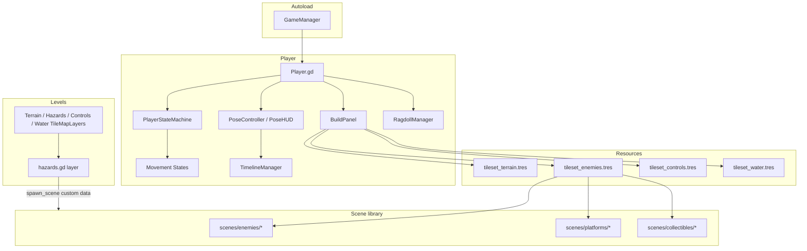

# Architecture

High-level map of Masquerade as it exists today. The project is mid-transition from a single platform game to an in-game creation studio; legacy paths are called out explicitly.

## System overview

## Domain map

| Domain | Location | Responsibility |
|--------|----------|----------------|
| Player body & input | `player/Player.gd` | Movement, combat hooks, water physics, mode flags (`is_posing`, debug) |
| Movement FSM | `player/states/` | `PlayerStateMachine` + states (ground, air, dash, ladder, wall, hang, dead, …) |
| Character studio | `player/pose/`, `player/PoseMarker.tscn` | Pose markers, timeline UI, animation authoring |
| Timeline | `player/components/TimelineManager.gd` | Step-based animation recording and playback |
| Ragdoll assist | `player/ragdoll/` | `RagdollManager`, `SyncedBone2D`, body slots for pose alignment |
| Level build UI | `player/build/BuildPanel.gd` | In-game tile painting against project tilesets |
| Levels | `levels/*.tscn` | Playable worlds; embed tilemap layers and scene instances |
| Entity library | `scenes/` | Enemies, hazards, collectibles, platforms, interactables, UI |
| Shared tilesets | `resources/tilesets/` | Terrain, enemies palette, environmental triggers, water |
| Sprite libraries | `resources/sprite_frames/` | Enemy animation frames (e.g. AngryPig, BadBunny) |
| Art | `assets/` | Textures, tile sheets, third-party character packs |
| Global game state | `scripts/autoload/game_manager.gd` | Score, keys, HP, checkpoints, respawn |

## Player stack

The player scene (`player/player.tscn`) composes several cooperating systems:

1. **`Player` (`class_name Player`)** — `CharacterBody2D` root; reads input, delegates to state machine; `is_posing` freezes movement in pose mode.
2. **`PlayerStateMachine`** — Holds current `PlayerState`; states extend `PlayerState` and receive the `Player` reference.
3. **`PoseHUD` / `PoseController`** — Studio UI shell and marker manipulation logic.
4. **`TimelineManager`** — Drives `AnimationPlayer` for stepped pose animations; keys marker properties.
5. **`PoseTimelinePanel`** — Primary animator workspace (bottom-centre dock): playback, step grid, ragdoll toggles, export.
6. **`PosePartPanel`** — Advanced per-marker inspector (right dock); hideable.
7. **`BuildPanel`** — `@tool` panel; loads tilesets and paints onto level layers. **Target:** bottom-centre dock in build mode (currently still in right dock).
8. **`RagdollManager`** — Optional physics-aligned skeleton helpers for pose authoring.

### Studio UI layout

| Zone | Nodes | Mode visibility (target) |
|------|-------|--------------------------|
| Left toolbar | `PoseToolBar`, `PoseModeBar` | Play / Pose / Build switcher |
| Bottom centre | `PoseTimelineDock` | Pose → timeline; Build → `BuildPanel`; Play → hidden |
| Right side | `PoseDockRow`, `PosePartPanel` | Pose → advanced config; Build/Play → hidden |
| Dormant | `AnimSection`, `PoseAssistantPanel` | Hidden; features live on timeline |

Tri-mode orchestration is planned in `PoseHUD` ([ROADMAP.md](../ROADMAP.md) phase 2). Today only a “Posing” checkbox exists and modes overlap (`is_posing` defaults true; `BuildPanel.paint_enabled` defaults true).

## Level model

Levels are Godot 4 scenes using **TileMapLayer** nodes. The build panel expects layers whose **node names** match this contract:

| Layer name | Tileset resource | Typical content |
|------------|------------------|-----------------|
| `Terrain` | `tileset_terrain.tres` | Ground, walls, scenery tiles (64×64 grid) |
| `Hazards` | `tileset_enemies.tres` | Enemy/collectible/platform **palette tiles** (legacy spawn) |
| `Controls` | `tileset_controls.tres` | Directional triggers, trampolines |
| `Water` | `tileset_water.tres` | Water surface tiles |

`BuildPanel` resolves the active level’s layers at runtime via the scene tree; layer names must stay consistent for painting to work.

## Tile pipeline (legacy spawn path)

**Status: deprecated** — see [LEGACY.md](LEGACY.md).

1. `tileset_enemies.tres` defines a custom data layer `spawn_scene` (type `PackedScene`).
2. Individual atlas tiles reference enemy, platform, collectible, or hazard scenes.
3. On level load, `scenes/environment/hazards/hazards.gd` (attached to the Hazards `TileMapLayer`) reads each cell’s `spawn_scene`, instantiates the scene, erases the tile, and parents the instance under an `Enemies` container (or level root).

This kept the Godot filesystem uncluttered for authors who only painted tiles. The in-game build editor is intended to replace this flow with **direct scene placement**.

## Enemy model

- **`BaseEnemy` (`scenes/enemies/BaseEnemy.gd`)** — `class_name` base for `CharacterBody2D` enemies; flight modes, HP, projectiles via `ProjectileLauncher`.
- **Variant scenes** — `enemy_bat.tscn`, `enemy_slime.tscn`, etc. extend or configure `BaseEnemy` with different `SpriteFrames` and exports.
- **Art** — Mostly 16×16–44×30 pixel pack sprites under `assets/enemies/`; collision and speeds assume a smaller scale than current terrain (see scale note below).

Enemies do **not** yet share the player’s state machine; convergence is planned ([ROADMAP.md](../ROADMAP.md) phase 4).

## Collectibles, hazards, platforms

Organized under `scenes/` by category:

- `collectibles/` — coin, key, heart, checkpoint
- `hazards/` — spikes, ladders
- `platforms/` — moving clouds, trampolines, propeller platforms
- `interactables/` — doors, exits
- `environment/` — atmosphere, wind, force arrows, direction triggers
- `projectiles/` — `Projectile`, `ProjectileLauncher`

## Autoloads and groups

| Name | Type | Role |
|------|------|------|
| `GameManager` | autoload (`scripts/autoload/game_manager.gd`) | Points, keys, HP, checkpoint position, respawn signal |
| `player` | global group | Identifies the controllable character |
| `ladders` | global group | Ladder climb detection |

`GameManager` is registered by UID in `project.godot`; path changes are safe if the `.uid` sidecar moves with the script.

## Physics and rendering

- **2D engine:** Rapier2D (`addons/godot-rapier2d`)
- **Gravity:** 4096 (project setting)
- **Viewport:** 1600×900 default

## Known scale mismatch (technical debt)

| Asset class | Typical size | Notes |
|-------------|--------------|-------|
| Environment tiles | 64×64 | `tileset_terrain.tres`, modern level art |
| Player character | 256×256+ | Rigged sprite body in `player/player.tscn` |
| Legacy enemies | 16×16–48×48 | `BaseEnemy` collision and speeds tuned for old grid |

Harmonizing these is a dedicated roadmap phase; new work should not assume 16px tiles for world scale.

## Extension points

Where new features should land:

| Feature | Prefer |
|---------|--------|
| New build tool UI | Extend `BuildPanel` or sibling under `player/build/`; place in bottom-centre dock |
| New frequent animator tool | Add to `PoseTimelinePanel` (not dormant `AnimSection`) |
| New advanced marker option | Extend `PosePartPanel` (right dock) |
| New pose tool | Extend `player/pose/` components |
| New enemy behavior | `BaseEnemy` subclass or exported config on variant scenes |
| New global game rule | `GameManager` or future session singleton (TBD) |
| New placed entity | `scenes/<category>/` + build palette entry (not new tile spawn bindings) |

## Related documents

- [STUDIO.md](STUDIO.md) — Author-facing workflows
- [LEGACY.md](LEGACY.md) — What not to extend
- [CONVENTIONS.md](CONVENTIONS.md) — File naming and refactor rules
