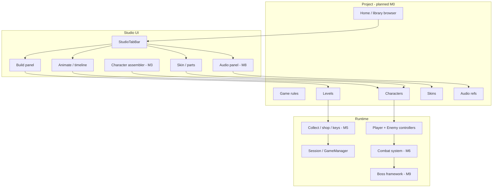
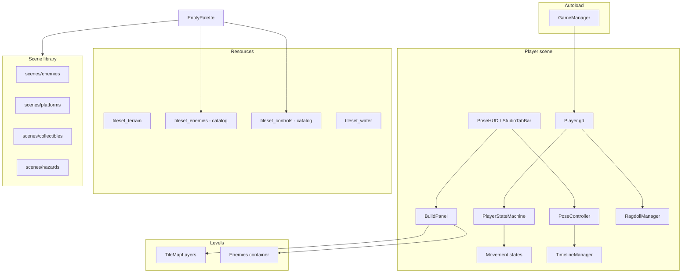

# Architecture

High-level map of Masquerade: what exists today and where the product is going. See [ROADMAP.md](../ROADMAP.md) for milestones M0–M10.

---

## Target architecture

---

## Current system overview

---

## Domain map

| Domain | Location | Responsibility |
|--------|----------|----------------|
| Player body & input | `player/Player.gd` | Movement, basic combat, `is_posing`, water physics |
| Movement FSM | `player/states/` | `PlayerStateMachine` + states |
| Studio shell | `player/pose/PoseHUD.gd` | Tab orchestration, input routing |
| Studio tabs | `player/pose/StudioTabBar.gd` | Skin / Animate / Build / Play |
| Character studio | `player/pose/`, `PoseMarker.tscn` | Markers, skin editing, animation |
| Timeline | `player/components/TimelineManager.gd` | Step-based animation |
| Level build | `player/build/BuildPanel.gd` | Tile paint, entity place, save |
| Level authoring gates | `player/build/LevelAuthoring.gd` | Entity sim on/off by tab |
| Levels | `levels/*.tscn` | Tile layers + placed instances |
| Entity library | `scenes/` | Enemies, hazards, collectibles, platforms |
| Tilesets | `resources/tilesets/` | Terrain, water, palette catalog metadata |
| Global gameplay state | `scripts/autoload/GameManager.gd` | HP, keys, points, checkpoints |
| Project model | — | **Planned M0** |
| Character library | — | **Planned M1** |
| Skin documents | — | **Planned M2** |
| Controllers / assembler | — | **Planned M3** |
| Collision layer | — | **Planned M4** |
| Shop / money | — | **Planned M5** |
| Combat v2 | — | **Planned M6** |
| Audio panel | — | **Planned M8** |
| Boss framework | — | **Planned M9** |

---

## Player stack (current)

`player/player.tscn` composes:

1. **`Player`** — `CharacterBody2D`; input, state machine, `is_posing`, basic `attack_area`
2. **`PlayerStateMachine`** — Ground, air, dash, ladder, wall, hang, dead, …
3. **`PoseHUD` / `PoseController`** — Studio UI and marker manipulation
4. **`StudioTabBar`** — Four tabs; drives dock visibility and `paint_enabled`
5. **`TimelineManager` / `PoseTimelinePanel`** — Animate tab workspace
6. **`PosePartPanel`** — Skin tab workspace (reparented into bottom dock area)
7. **`BuildPanel`** — Build tab; tile + entity authoring
8. **`PlayStatsPanel`** — Play tab minimal UI
9. **`RagdollManager`** — Optional pose-alignment helpers

Tab orchestration: `PoseHUD._apply_studio_tab` (replaces legacy `_apply_studio_mode` / `PoseModeBar`).

### Studio UI layout (current)

| Zone | Nodes | Visibility |
|------|-------|------------|
| Bottom tabs | `StudioTabBar` | Always (in dock) |
| Bottom dock | `PoseTimelinePanel`, `BuildPanel`, `PlayStatsPanel`, `PosePartPanel` | Per tab |
| Legacy toolbar | `PoseToolBar`, `PoseModeBar` | Hidden |
| Dormant | `AnimSection`, `PoseAssistantPanel` | Hidden |

---

## Level model (current)

Levels are Godot 4 scenes with **TileMapLayer** nodes and an **Enemies** container.

| Layer / node | Typical content |
|--------------|-----------------|
| `Terrain` | Ground, scenery (64×64) |
| `Water` | Water tiles |
| `TerrainBackground` / `TerrainForeground` | Parallax-style layers |
| `Enemies` | Placed entity scenes (not a tile layer) |

`BuildPanel` discovers layers via `TileLayerCatalog.gd`. Entities tab places into `Enemies` with grid snap.

### Level model (planned M4)

| Layer | Role |
|-------|------|
| `Collision` | Shape tiles for physics only; **hidden on Play** |
| Art layers | Visual tiles only; no gameplay collision requirement |

---

## Entity placement (current)

1. `EntityPalette.gd` reads `spawn_scene` from tilesets → palette thumbnails only
2. `BuildPanel` instantiates scenes under `Enemies`
3. `LevelSave.gd` persists level via Save button

Runtime tile-to-scene conversion (`hazards.gd`) is **removed**.

**Planned M3:** Place **character** assets (skin + controller) instead of raw enemy scenes.

---

## Gameplay (current vs planned)

| System | Current | Planned |
|--------|---------|---------|
| HP / respawn | `GameManager` | Per-project rules (M5) |
| Keys | Collect → `GameManager.keys` | Gate exits / next level (M5) |
| Points | `GameManager.points` | **Money** currency + shop (M5) |
| Combat | Basic melee `attack_area` | Hitboxes, i-frames, telegraphs (M6) |
| Collectables | coin, key, heart, checkpoint | Expanded library (M5, M7) |
| Bosses | — | Phased boss controllers (M9) |
| Audio | Scene-local players | Studio audio panel (M8) |

---

## Enemy model (current)

- **`BaseEnemy`** — `CharacterBody2D` base; flight modes, HP, projectiles
- **Variants** — bat, slime, pig, etc. with `SpriteFrames`
- **Scale debt** — 16px-era art vs 64px terrain (harmonize in M3/M6)

Enemies do **not** share the player FSM. **M3** introduces controller abstraction to converge behaviour.

---

## Autoloads and groups

| Name | Role |
|------|------|
| `GameManager` | HP, keys, points, checkpoint, respawn |
| `player` (group) | Controllable character |
| `ladders` (group) | Ladder climb detection |

**M0/M5:** Split editor/project state from runtime session state.

---

## Physics and rendering

- **2D engine:** Rapier2D (`addons/godot-rapier2d`)
- **Gravity:** 4096
- **Viewport:** 1600×900 default

---

## Extension points

| Feature | Prefer |
|---------|--------|
| New build tool | `player/build/`; bottom dock |
| New animator tool | `PoseTimelinePanel` (not `AnimSection`) |
| New skin/part option | `PosePartPanel`; later parts library (M2) |
| New placed entity | `scenes/<category>/` + palette entry |
| New character behaviour | Controller module (M3) |
| New game rule | Project rules resource (M5), not raw `GameManager` hacks |
| New audio assignment | Audio panel (M8) |

---

## Related documents

- [STUDIO.md](STUDIO.md) — Author-facing workflows
- [ROADMAP.md](../ROADMAP.md) — Milestones
- [LEGACY.md](LEGACY.md) — Deprecated patterns
- [CONVENTIONS.md](CONVENTIONS.md) — Naming and refactors
